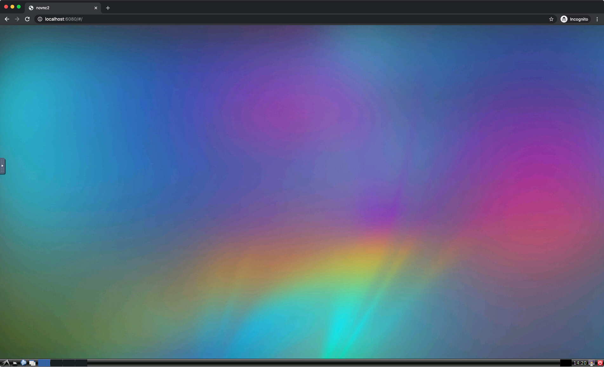

# [MIT](https://github.com/mit-racecar) Racecar Workspace

## Environment

`Dockerfiles` folder includes dockerfiles for building the workspace environment which contains ROS, ROS-Gazebo and other dependencies.

Navigate to one of the ros-distros `kinetic` or `melodic` in the `Dockerfiles` folder and build the image:

```
docker build -t racecar/platform .
```

Run the image with volume mounted of this repository and connect to VNC with your browser https://localhost:6080/

```
docker run -v "`pwd`/racecar_ws:/home/ubuntu/racecar_ws/src/" -it --rm -p 6080:80 racecar/platform
```

After the image is mounted ssh into the container and build the catkin worspaces

```
cd /home/ubuntu/racecar_ws
catkin_make
```

Folder structure:

- `/home/ubuntu/racecar_ws/src/`
  - `CMakeLists.txt`
  - `racecar_simulator/`
  - `racecar_gazebo/`
  - `racecar_controller/`
  - `package n`

### Using the Image in the browser

<details>
<summary>To use the image in the browser, navigate to http://localhost:6080/. Hit the "Connect" button and you're in!</summary>



</details>

### Running ROS

Launch ROS by running:

```
cd /home/ubuntu/racecar_ws
source devel/setup.bash
roscore
```

### Running the Racecar Simulator

You can launch it by running:

    roslaunch racecar_simulator simulate.launch

To see the simulated car, you will need to open [`rviz`](http://wiki.ros.org/rviz) by typing

    rviz

<details>
<summary>You should see a car in a map (walls are black, empty space is grey) and points on that map representing the points hit by the car's lidar. </summary>


</details>

### Running the Gazebo Simulator

Launch Gazebo simulator by running:

```
cd /home/ubuntu/racecar_ws
source devel/setup.bash
roslaunch racecar_gazebo racecar_tunnel.launch
```
